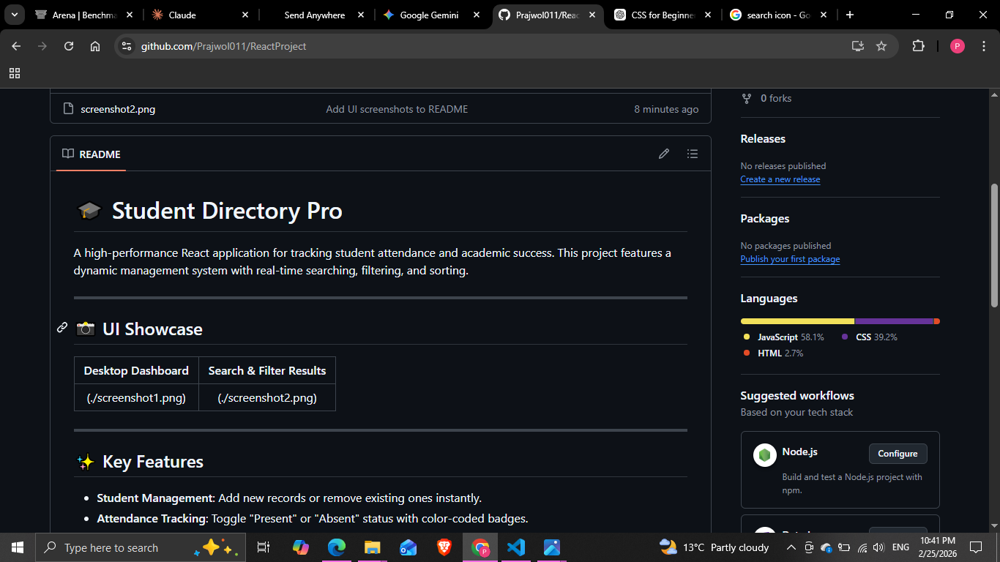

# 🎓 Student Directory

A high-performance React application for tracking student attendance and academic success. This project features a dynamic management system with real-time searching, filtering, and sorting.

---

## 📸 UI Showcase


|  |  | 

---

## ✨ Key Features

* **Student Management**: Add new records or remove existing ones instantly.
* **Attendance Tracking**: Toggle "Present" or "Absent" status with color-coded badges.
* **Smart Toolbar**:
    * **Search**: Filter students by name as you type.
    * **Filter**: Sort by attendance status (All, Present, Absent).
    * **Sort**: Organize by name (A-Z) or academic grade (High-Low).
* **Top Performer Recognition**: Automatic ⭐ badges for students with grades ≥ 90%.
* **Responsive UI**: Fully optimized for mobile, tablet, and desktop screens..


### Setup & Installation

1.  **Clone the Repository**:
    ```bash
    git clone [https://github.com/Prajwol011/ReactProject.git](https://github.com/Prajwol011/ReactProject.git)
    ```
2.  **Navigate to the Directory**:
    ```bash
    cd ReactProject
    ```
3.  **Install Dependencies**:
    ```bash
    npm install
    ```
4.  **Launch the Application**:
    ```bash
    npm start
    ```
    The app will automatically open at `http://localhost:3000`.

---

## 🛠️ Technical Stack
* **React**: Functional components and Hooks (`useState`, `useEffect`).
* **CSS3**: Custom variables, Grid, and Flexbox for a modern layout.
* **Architecture**: Modular design with reusable `Badge`, `Button`, and `Card` components.